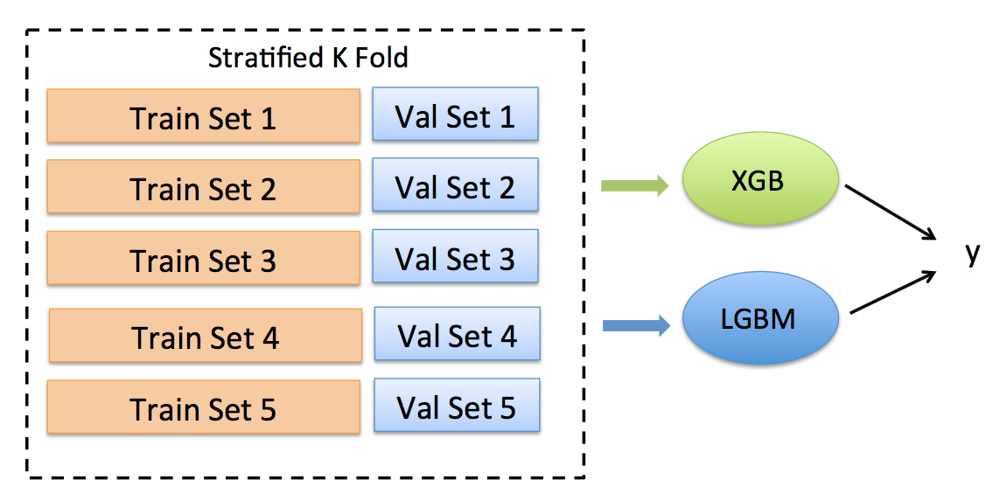

# [Credit Card Fraud Detection](https://www.kaggle.com/c/ieee-fraud-detection) 

## Overview of the Problem 

This competition requires predicting the probability that an online transaction is fraudulent.

The [training data](https://www.kaggle.com/c/ieee-fraud-detection/data) contains information of many online transactions, includes the transaction amount, time, card info, etc. These transactions are also labled as fraud or not.

The challange is that there are lots of missing values in the training dataset.

## My Solution

My solution features a combination of two boosting tree methods: XGBoost and LightGBM. Both models runs fast and can handle missing value in the training dataset. 

Below is a diagram of my solution.

## Running

* The notebook should run on Google Colab (Make sure you use a GPU machine).
* The training dataset will be automatically downloaded from Kaggle, but requires your Kaggle API key. 
